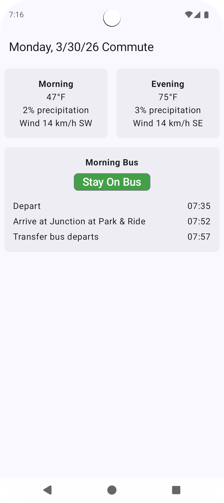

# Overview
This Android app provides at-a-glance commute planning for a fixed daily transit route in my hometown. It displays real-time bus departure and transfer timing alongside weather forecasts for both the morning and evening commutes, letting me know at a glance whether it's a nice day for biking, and if not whether the bus is on time to make my preferred transfer.

Right now, everything is hardcoded to my location and my specific bus route, but I plan to make that customizable in the future.

# Features

## Smart Transfer Analysis
The app evaluates real-time bus departure data to determine the best strategy for making a timed transfer between two routes. It calculates whether a connecting bus will be available at each potential transfer stop and presents a clear recommendation:
- **Stay On Bus** — ride to the preferred transfer point for a comfortable connection
- **Get Off Early** — exit at an earlier stop to catch the connecting bus in time
- **Missed** — no viable connection is available for the upcoming departure

## Morning and Evening Commutes
Separate commute profiles handle the outbound and return journeys. The app automatically highlights the relevant commute based on time of day, and advances the displayed date past 17:30 to prepare for the next day's commute.

## Weather Forecasts
Hourly weather data is fetched for both commute departure times, displaying temperature, precipitation probability, and wind speed and direction. Both morning and evening forecasts are shown side-by-side for quick reference since I need to know about both to decide whether I should bike or bus to work.

## Pull-to-Refresh
Bus timing and weather data can be refreshed on demand. 
A one-minute cache prevents excessive API calls during repeated refreshes.

# Technical Details
This app was built with [Kotlin](https://kotlinlang.org/) and [Jetpack Compose](https://developer.android.com/compose).

 ## Libraries Used
[Retrofit 3](https://github.com/square/retrofit)  and [OkHttp 4](https://github.com/square/okhttp) for type-safe HTTP API calls.
 
[Gson](https://github.com/google/gson) for JSON deserialization

## External APIs
[Transit App](https://transitapp.com/partners/apis) for real-time stop departures and trip details.
 
[Open-Meteo](https://open-meteo.com/) for hourly weather forecasts.
